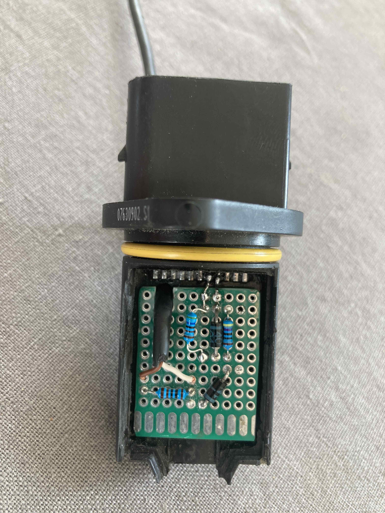
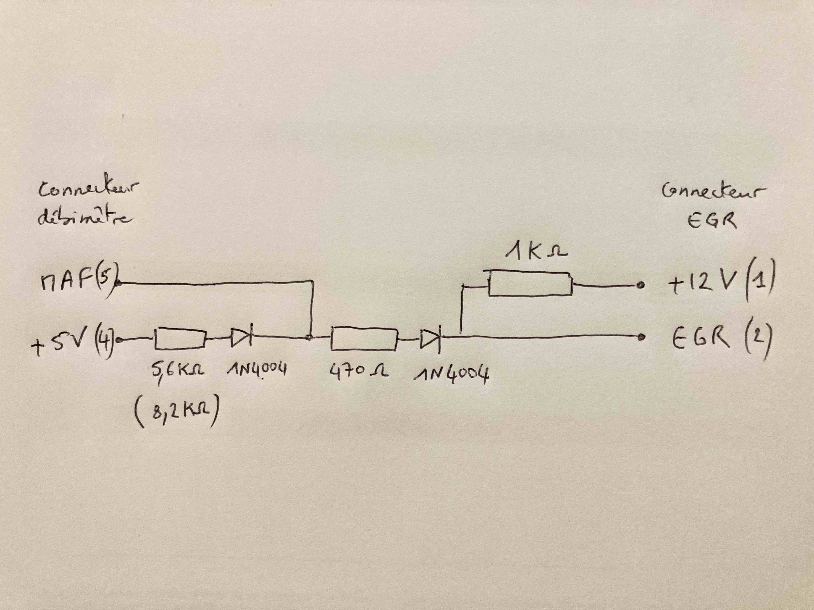
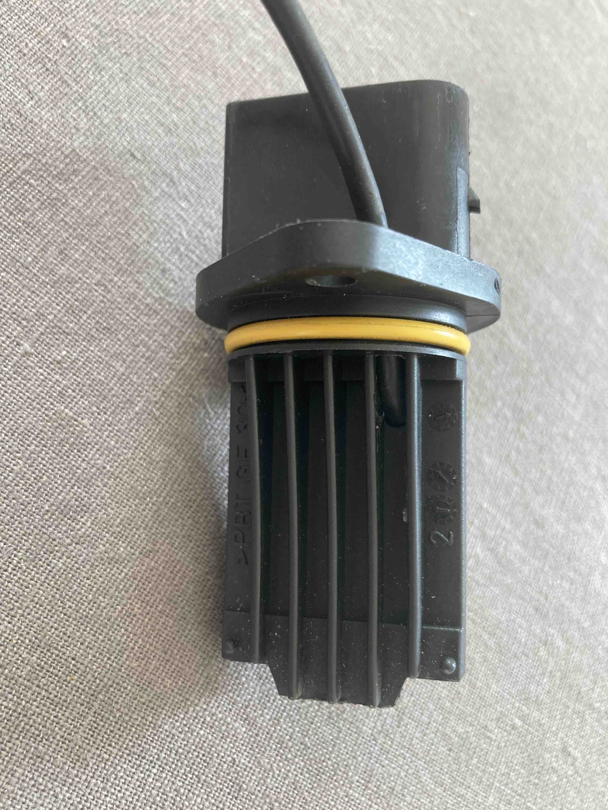
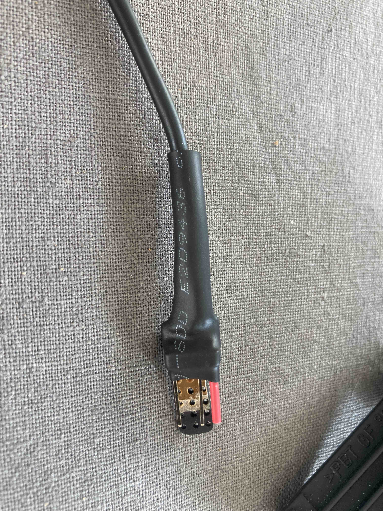
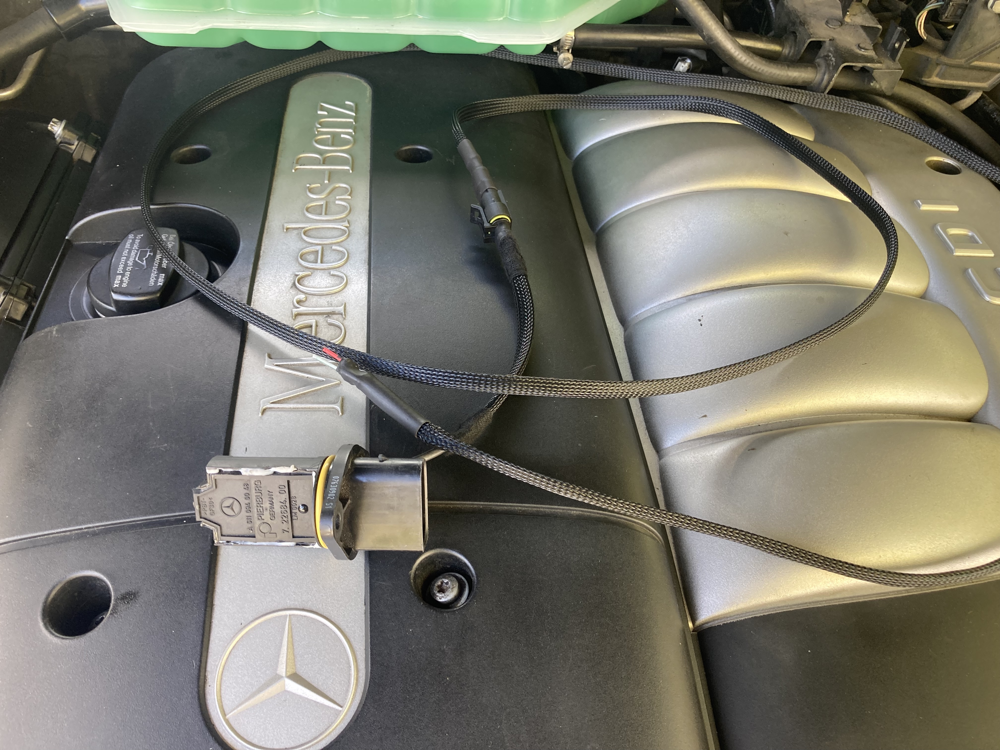
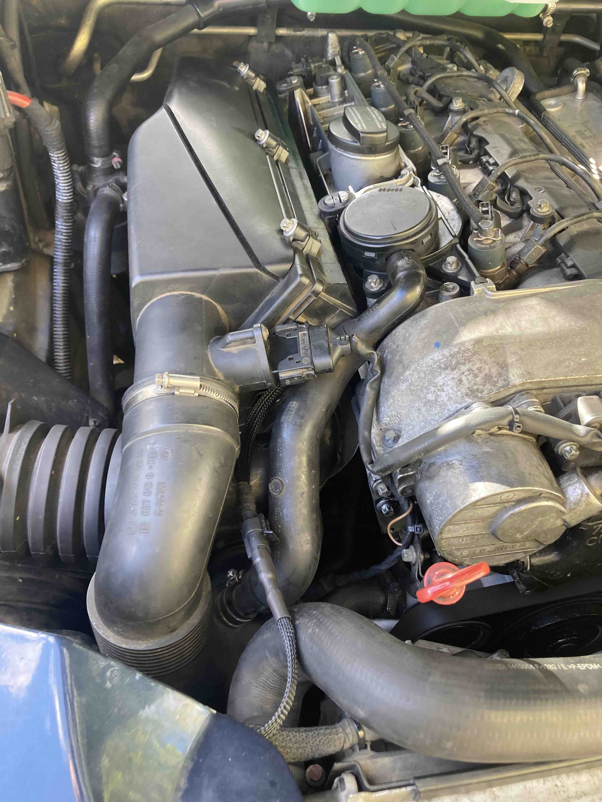

# Supershunt ML270

Le supershunt est un petit montage qui permet de shunter le débimètre (MAF) **ET** l'EGR sur le moteur OM612 du ML 270.

Suite au changement du débimètre sur un ML270 phase 2 avec shunt EGR, le moteur passait en mode dégradé (P1403-032, le taux de recyclage des gaz d'échappement est trop bas) et ce malgré deux modèles de débimètre différents (un Hella et un Pierburg).

Après des heures et des heures d'essai et de démontage remontage, je suis tombé sur [ce forum anglais](https://forums.mercedesclub.org.uk/index.php?threads/maf-delete-cdi-2.178561/) d'où était parti le [shunt EGR originel](https://forums.mercedesclub.org.uk/index.php?threads/disabling-egr.68928/)... 

La première explication est la suivante : les nouveaux modèles de débimètre ne tolèrent pas que le shunt EGR leur pompe 20mA sur le signal MAF et donc mettent le calculateur en erreur si on utilise le shunt EGR, d'où le P1403-032.

La deuxième explication est que le débimètre ne sert presque à rien sur le ML 270. Il ne fait que vérifier que l'EGR fonctionne normalement c'est à dire que le débit baisse lorsque la vanne EGR s'ouvre. Il ne module pas l'admission d'air par le turbo.

Le supershunt remplace le débimètre et shunt la vanne EGR. Il peut s'insérer dans le boitier d'un débimètre H.S. et se branche sur le cable qui commande le transducteur de la vanne EGR. Pas besoin d'aller modifier le faisceau au niveau du calculateur.



Le schéma suivant regroupe le shunt EGR et le MAF delete décrits par Dieselman et Stumo sur MBO. A noter que dans certains cas, il faut changer la première résistance par une 8,2K.



```
Connecteur débimètre (PLUG 4 du calculateur)
--------------------
5 : signal MAF (ge/ws, 24)
4 : +5V (bl/ge, 1)
3 : masse GND (bl, 34)
2 : +12V (rt/bl, 11)
1 : non connecté NC

Connecteur transducteur EGR (PLUG 3 du calculateur)
---------------------------
2 : signal EGR (ge/sw, 50)
1 : +12V (rt/gr, 37)
```





Le montage final avec le capot recollé.



Photo une fois monté. Penser à faire un fil assez long pour le passer le long de l'aile et derrière le bocal de liquide de refroidissement. Le transducteur EGR est donc débranché en permanence, on peut même l'enlever et simplifier le circuit du vide en enlevant le Y qui va au transducteur (et ne laissant que le flexible de vide qui va au turbo). On peut également enlever le transducteur et la durite de vide qui va à la vanne EGR.
 


NB: ces informations sont données uniquement pour la compréhension du fonctionnement de l'EGR et du débimètre.

Elpekos, septembre 2023.
